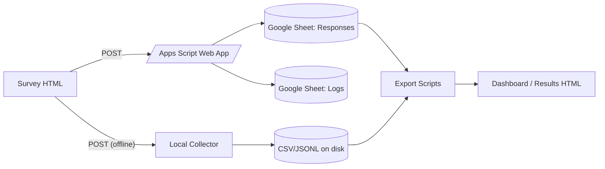

# Integration Blueprint

This project connects a browser survey form to Google Sheets (via Apps Script) and to local tooling for offline collection and analysis.

Mermaid Diagram

Notes
- Trust boundaries: Browser → (public) `/exec` endpoint; Apps Script writes to Sheets inside your account.
- Logs: `Logs` tab captures successes/failures with timestamps and context.
- Offline path: `agents/logic/local-collector` writes CSV and JSONL locally when Apps Script is not used.

Typical Flow
1. Deploy Apps Script Web App and set form `action` to the `/exec` URL.
2. Submissions append to `Responses`; failures are recorded in `Logs`.
3. Optionally, run the local collector for offline capture.
4. Export scripts aggregate to JSON for dashboards.

What Breaks Most Often
- Wrong `/exec` URL or permissions → redeploy and copy the current URL.
- Missing headers → advanced collector auto-creates/extends headers.
- Large payloads → trim long text; see Logs for truncation.

